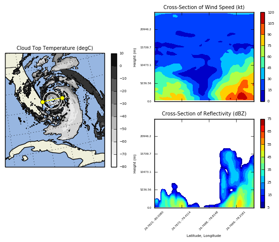

.. wrf-python documentation master file, created by
   sphinx-quickstart on Wed Jun 29 14:57:16 2016.
   You can adapt this file completely to your liking, but it should at least
   contain the root `toctree` directive.

.. meta::
   :description: Diagnostic and interpolation routines for WRF ARW data
   :keywords: wrf, python, wrf-python, weather research and forecasting,
              weather research and forecasting model, model, weather,
              numerical weather prediction, model, matplotlib, cartopy,
              wrf-arw, arw, ncar, ucar, cisl, ncl, ncar command language,
              national center for atmospheric research, 
              university corporation for atmospheric research,
              pynio, pyngl, interpolation

.. .. image:: _static/images/nsf.png    
..    :scale: 100%
..   :align: right

.. |
.. |

wrf-python
===========

A collection of diagnostic and interpolation routines for use with output from 
the Weather Research and Forecasting (WRF-ARW) Model.

This package provides over 30 diagnostic calculations, 
several interpolation routines, and utilities to help with plotting 
via cartopy, basemap, or PyNGL. The functionality is similar to what is 
provided by the NCL WRF package. 

When coupled with either matplotlib or PyNGL, users can create plots like this:

Documentation
==================

.. toctree::
   :maxdepth: 2
   
   ./new
   ./installation
   ./diagnostics
   ./basic_usage
   ./plot
   ./api
   ./faq
   ./support
   ./contrib
   ./internals
   ./citation
   ./license
   ./tutorial

Indices and tables
==================

* :ref:`genindex`
* :ref:`modindex`
* :ref:`search`

--------------------

*The National Center for Atmospheric Research is sponsored by the National 
Science Foundation. Any opinions, findings and conclusions or recommendations 
expressed in this material do not necessarily reflect the views of the 
National Science Foundation.*

