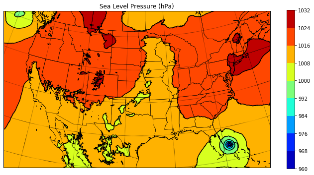
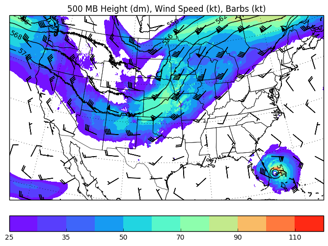
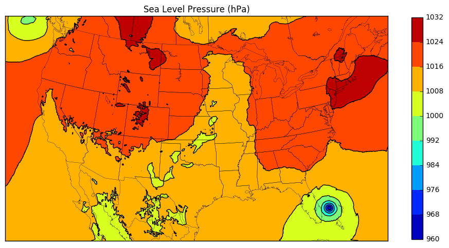
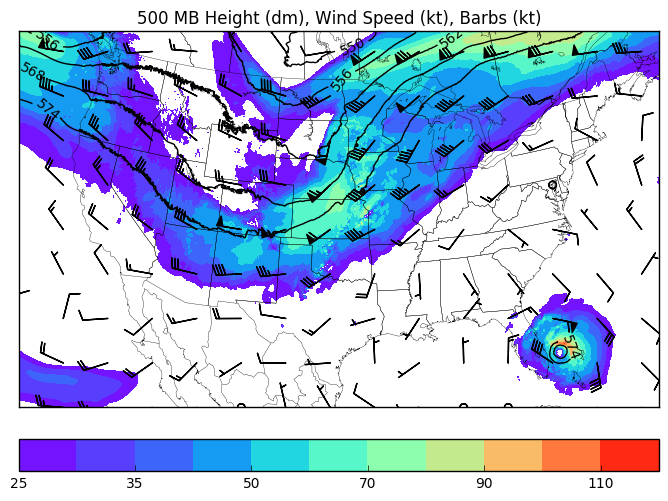
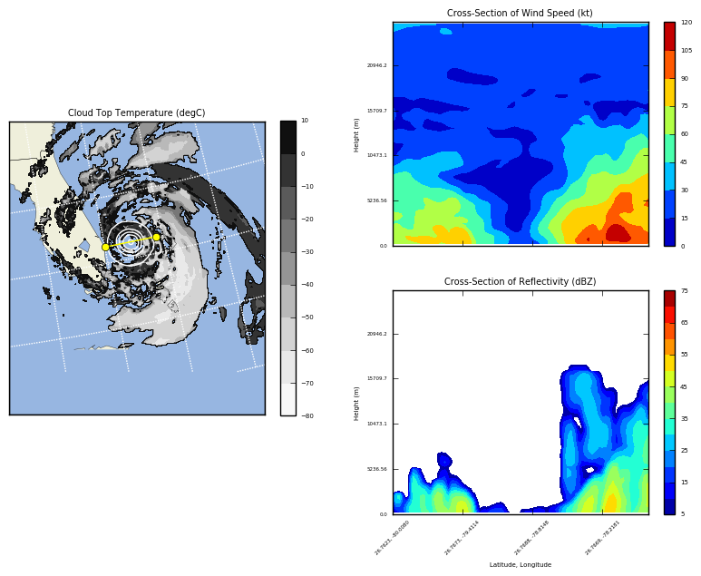
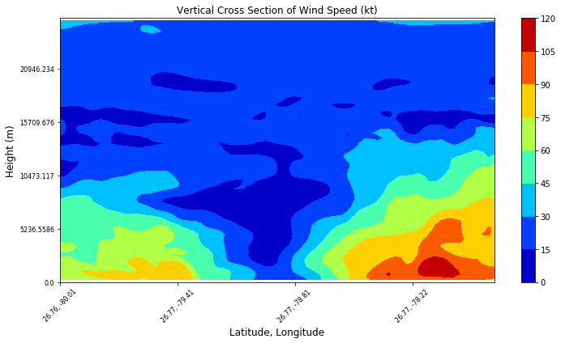
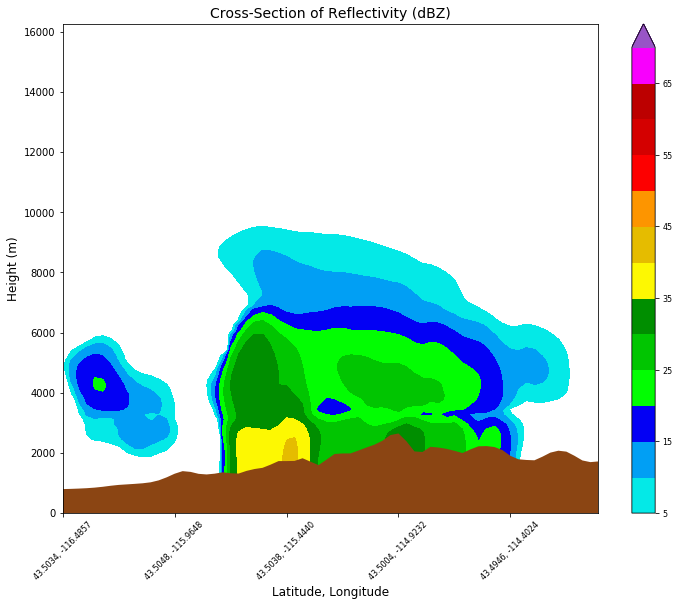

Plotting Examples
=================

The examples below show how wrf-python can be used to make plots with 
matplotlib (with basemap and cartopy) and PyNGL.  None of these examples 
make use of xarray's builtin plotting functions, since additional work is most
likely needed to extend xarray in order to work correctly.  This is planned 
for a future release.

A subset of the wrfout file used in these examples can be downloaded `here <https://doi.org/10.5065/yd8c-hm41>`_.

Matplotlib With Cartopy
-------------------------

Cartopy is becoming the main tool for base mapping with matplotlib, but you 
should  be aware of a few shortcomings when working with WRF data.

- The builtin transformations of coordinates when calling the contouring 
  functions do not work correctly with the rotated pole projection.  The 
  transform_points method needs to be called manually on the latitude and 
  longitude arrays.
  
- The rotated pole projection requires the x and y limits to be set manually
  using set_xlim and set_ylim.

- You can't place latitude and longitude labels on the axes when using 
  any projection other than Mercator or LatLon.

Plotting a Two-dimensional Field
^^^^^^^^^^^^^^^^^^^^^^^^^^^^^^^^^^^

   
.. code-block:: python
    
    from netCDF4 import Dataset   
    import matplotlib.pyplot as plt
    from matplotlib.cm import get_cmap
    import cartopy.crs as crs
    from cartopy.feature import NaturalEarthFeature
    
    from wrf import (to_np, getvar, smooth2d, get_cartopy, cartopy_xlim, 
                     cartopy_ylim, latlon_coords)
    
    # Open the NetCDF file
    ncfile = Dataset("wrfout_d01_2016-10-07_00_00_00")
    
    # Get the sea level pressure
    slp = getvar(ncfile, "slp")
    
    # Smooth the sea level pressure since it tends to be noisy near the 
    # mountains
    smooth_slp = smooth2d(slp, 3, cenweight=4)
    
    # Get the latitude and longitude points
    lats, lons = latlon_coords(slp)
    
    # Get the cartopy mapping object
    cart_proj = get_cartopy(slp)
    
    # Create a figure
    fig = plt.figure(figsize=(12,6))
    # Set the GeoAxes to the projection used by WRF
    ax = plt.axes(projection=cart_proj)
    
    # Download and add the states and coastlines
    states = NaturalEarthFeature(category="cultural", scale="50m", 
                                 facecolor="none",
                                 name="admin_1_states_provinces_shp")
    ax.add_feature(states, linewidth=.5, edgecolor="black")
    ax.coastlines('50m', linewidth=0.8)
    
    # Make the contour outlines and filled contours for the smoothed sea level 
    # pressure.
    plt.contour(to_np(lons), to_np(lats), to_np(smooth_slp), 10, colors="black", 
                transform=crs.PlateCarree())
    plt.contourf(to_np(lons), to_np(lats), to_np(smooth_slp), 10, 
                 transform=crs.PlateCarree(), 
                 cmap=get_cmap("jet"))
    
    # Add a color bar
    plt.colorbar(ax=ax, shrink=.98)
    
    # Set the map bounds
    ax.set_xlim(cartopy_xlim(smooth_slp))
    ax.set_ylim(cartopy_ylim(smooth_slp))
    
    # Add the gridlines
    ax.gridlines(color="black", linestyle="dotted")

    plt.title("Sea Level Pressure (hPa)")

    plt.show()

Horizontal Interpolation to a Pressure Level
^^^^^^^^^^^^^^^^^^^^^^^^^^^^^^^^^^^^^^^^^^^^^

    
.. code-block:: python

    from netCDF4 import Dataset 
    import numpy as np
    import matplotlib.pyplot as plt
    from matplotlib.cm import get_cmap
    import cartopy.crs as crs
    from cartopy.feature import NaturalEarthFeature
    
    from wrf import (getvar, interplevel, to_np, latlon_coords, get_cartopy, 
                     cartopy_xlim, cartopy_ylim)
    
    # Open the NetCDF file
    ncfile = Dataset("wrfout_d01_2016-10-07_00_00_00")
    
    # Extract the pressure, geopotential height, and wind variables
    p = getvar(ncfile, "pressure")
    z = getvar(ncfile, "z", units="dm")
    ua = getvar(ncfile, "ua", units="kt")
    va = getvar(ncfile, "va", units="kt")
    wspd = getvar(ncfile, "wspd_wdir", units="kts")[0,:]
    
    # Interpolate geopotential height, u, and v winds to 500 hPa 
    ht_500 = interplevel(z, p, 500)
    u_500 = interplevel(ua, p, 500)
    v_500 = interplevel(va, p, 500)
    wspd_500 = interplevel(wspd, p, 500)
    
    # Get the lat/lon coordinates
    lats, lons = latlon_coords(ht_500)
    
    # Get the map projection information
    cart_proj = get_cartopy(ht_500)
    
    # Create the figure
    fig = plt.figure(figsize=(12,9))
    ax = plt.axes(projection=cart_proj)
    
    # Download and add the states and coastlines
    states = NaturalEarthFeature(category="cultural", scale="50m", 
                                 facecolor="none",
                                 name="admin_1_states_provinces_shp")
    ax.add_feature(states, linewidth=0.5, edgecolor="black")
    ax.coastlines('50m', linewidth=0.8)
    
    # Add the 500 hPa geopotential height contours
    levels = np.arange(520., 580., 6.)
    contours = plt.contour(to_np(lons), to_np(lats), to_np(ht_500), 
                           levels=levels, colors="black", 
                           transform=crs.PlateCarree())
    plt.clabel(contours, inline=1, fontsize=10, fmt="%i")
    
    # Add the wind speed contours
    levels = [25, 30, 35, 40, 50, 60, 70, 80, 90, 100, 110, 120]
    wspd_contours = plt.contourf(to_np(lons), to_np(lats), to_np(wspd_500), 
                                 levels=levels,
                                 cmap=get_cmap("rainbow"), 
                                 transform=crs.PlateCarree())
    plt.colorbar(wspd_contours, ax=ax, orientation="horizontal", pad=.05)
    
    # Add the 500 hPa wind barbs, only plotting every 125th data point.
    plt.barbs(to_np(lons[::125,::125]), to_np(lats[::125,::125]), 
              to_np(u_500[::125, ::125]), to_np(v_500[::125, ::125]), 
              transform=crs.PlateCarree(), length=6)
    
    # Set the map bounds
    ax.set_xlim(cartopy_xlim(ht_500))
    ax.set_ylim(cartopy_ylim(ht_500))
    
    ax.gridlines()
    
    plt.title("500 MB Height (dm), Wind Speed (kt), Barbs (kt)")
    
    plt.show()
    

Panel Plots From Front Page
^^^^^^^^^^^^^^^^^^^^^^^^^^^^

This lengthy example shows how to make the panel plots on the first page 
of the documentation.  For a simpler example of how to make a cross section 
plot, see :ref:`cross_example`.

.. image:: _static/images/matthew.png    
   :scale: 100%
   :align: center

.. code-block:: python

    import numpy as np
    import matplotlib.pyplot as plt
    from matplotlib.cm import get_cmap
    import cartopy.crs as crs
    import cartopy.feature as cfeature
    from netCDF4 import Dataset
    
    from wrf import (getvar, to_np, vertcross, smooth2d, CoordPair, GeoBounds, 
                     get_cartopy, latlon_coords, cartopy_xlim, cartopy_ylim)
    
    # Open the NetCDF file
    ncfile = Dataset("wrfout_d01_2016-10-07_00_00_00")
    
    # Get the WRF variables
    slp = getvar(ncfile, "slp")
    smooth_slp = smooth2d(slp, 3)
    ctt = getvar(ncfile, "ctt")
    z = getvar(ncfile, "z")
    dbz = getvar(ncfile, "dbz")
    Z = 10**(dbz/10.)
    wspd =  getvar(ncfile, "wspd_wdir", units="kt")[0,:]
    
    # Set the start point and end point for the cross section
    start_point = CoordPair(lat=26.76, lon=-80.0)
    end_point = CoordPair(lat=26.76, lon=-77.8)
    
    # Compute the vertical cross-section interpolation.  Also, include the 
    # lat/lon points along the cross-section in the metadata by setting latlon 
    # to True.
    z_cross = vertcross(Z, z, wrfin=ncfile, start_point=start_point, 
                        end_point=end_point, latlon=True, meta=True)
    wspd_cross = vertcross(wspd, z, wrfin=ncfile, start_point=start_point, 
                           end_point=end_point, latlon=True, meta=True)
    dbz_cross = 10.0 * np.log10(z_cross)
    
    # Get the lat/lon points
    lats, lons = latlon_coords(slp)
    
    # Get the cartopy projection object
    cart_proj = get_cartopy(slp)
    
    # Create a figure that will have 3 subplots
    fig = plt.figure(figsize=(12,9))
    ax_ctt = fig.add_subplot(1,2,1,projection=cart_proj)
    ax_wspd = fig.add_subplot(2,2,2)
    ax_dbz = fig.add_subplot(2,2,4)
    
    # Download and create the states, land, and oceans using cartopy features
    states = cfeature.NaturalEarthFeature(category='cultural', scale='50m', 
                                          facecolor='none',
                                          name='admin_1_states_provinces_shp')
    land = cfeature.NaturalEarthFeature(category='physical', name='land', 
                                        scale='50m', 
                                        facecolor=cfeature.COLORS['land'])
    ocean = cfeature.NaturalEarthFeature(category='physical', name='ocean', 
                                         scale='50m', 
                                         facecolor=cfeature.COLORS['water'])
    
    # Make the pressure contours
    contour_levels = [960, 965, 970, 975, 980, 990]
    c1 = ax_ctt.contour(lons, lats, to_np(smooth_slp), levels=contour_levels, 
                        colors="white", transform=crs.PlateCarree(), zorder=3, 
                        linewidths=1.0)
    
    # Create the filled cloud top temperature contours
    contour_levels = [-80.0, -70.0, -60, -50, -40, -30, -20, -10, 0, 10]
    ctt_contours = ax_ctt.contourf(to_np(lons), to_np(lats), to_np(ctt), 
                                   contour_levels, cmap=get_cmap("Greys"), 
                                   transform=crs.PlateCarree(), zorder=2)
    
    ax_ctt.plot([start_point.lon, end_point.lon], 
                [start_point.lat, end_point.lat], color="yellow", marker="o", 
                transform=crs.PlateCarree(), zorder=3)
    
    # Create the color bar for cloud top temperature
    cb_ctt = fig.colorbar(ctt_contours, ax=ax_ctt, shrink=.60)
    cb_ctt.ax.tick_params(labelsize=5)
    
    # Draw the oceans, land, and states
    ax_ctt.add_feature(ocean)
    ax_ctt.add_feature(land)
    ax_ctt.add_feature(states, linewidth=.5, edgecolor="black")
    
    # Crop the domain to the region around the hurricane
    hur_bounds = GeoBounds(CoordPair(lat=np.amin(to_np(lats)), lon=-85.0),
                           CoordPair(lat=30.0, lon=-72.0))
    ax_ctt.set_xlim(cartopy_xlim(ctt, geobounds=hur_bounds))
    ax_ctt.set_ylim(cartopy_ylim(ctt, geobounds=hur_bounds))
    ax_ctt.gridlines(color="white", linestyle="dotted")
    
    # Make the contour plot for wind speed
    wspd_contours = ax_wspd.contourf(to_np(wspd_cross), cmap=get_cmap("jet"))
    # Add the color bar
    cb_wspd = fig.colorbar(wspd_contours, ax=ax_wspd)
    cb_wspd.ax.tick_params(labelsize=5)
    
    # Make the contour plot for dbz
    levels = [5 + 5*n for n in range(15)]
    dbz_contours = ax_dbz.contourf(to_np(dbz_cross), levels=levels, 
                                   cmap=get_cmap("jet"))
    cb_dbz = fig.colorbar(dbz_contours, ax=ax_dbz)
    cb_dbz.ax.tick_params(labelsize=5)
    
    # Set the x-ticks to use latitude and longitude labels
    coord_pairs = to_np(dbz_cross.coords["xy_loc"])
    x_ticks = np.arange(coord_pairs.shape[0])
    x_labels = [pair.latlon_str() for pair in to_np(coord_pairs)]
    ax_wspd.set_xticks(x_ticks[::20])
    ax_wspd.set_xticklabels([], rotation=45)
    ax_dbz.set_xticks(x_ticks[::20])
    ax_dbz.set_xticklabels(x_labels[::20], rotation=45, fontsize=4) 
    
    # Set the y-ticks to be height
    vert_vals = to_np(dbz_cross.coords["vertical"])
    v_ticks = np.arange(vert_vals.shape[0])
    ax_wspd.set_yticks(v_ticks[::20])
    ax_wspd.set_yticklabels(vert_vals[::20], fontsize=4) 
    ax_dbz.set_yticks(v_ticks[::20])
    ax_dbz.set_yticklabels(vert_vals[::20], fontsize=4) 
    
    # Set the x-axis and  y-axis labels
    ax_dbz.set_xlabel("Latitude, Longitude", fontsize=5)
    ax_wspd.set_ylabel("Height (m)", fontsize=5)
    ax_dbz.set_ylabel("Height (m)", fontsize=5)
    
    # Add a title
    ax_ctt.set_title("Cloud Top Temperature (degC)", {"fontsize" : 7})
    ax_wspd.set_title("Cross-Section of Wind Speed (kt)", {"fontsize" : 7})
    ax_dbz.set_title("Cross-Section of Reflectivity (dBZ)", {"fontsize" : 7})
    
    plt.show()

Matplotlib with Basemap
-----------------------

Although basemap is in maintenance mode only and becoming deprecated, it is 
still widely used by many programmers.  Cartopy is becoming the preferred 
package for mapping, however it suffers from growing pains in some areas 
(can't use latitude/longitude labels for many map projections).  If you 
run in to these issues, basemap is likely to accomplish what you need.

Plotting a Two-Dimensional Field
^^^^^^^^^^^^^^^^^^^^^^^^^^^^^^^^^^^^

.. code-block:: python
    
    from netCDF4 import Dataset   
    import matplotlib.pyplot as plt
    from matplotlib.cm import get_cmap
    from mpl_toolkits.basemap import Basemap
    
    from wrf import to_np, getvar, smooth2d, get_basemap, latlon_coords
    
    # Open the NetCDF file
    ncfile = Dataset("wrfout_d01_2016-10-07_00_00_00")
    
    # Get the sea level pressure
    slp = getvar(ncfile, "slp")
    
    # Smooth the sea level pressure since it tends to be noisy near the 
    # mountains
    smooth_slp = smooth2d(slp, 3, cenweight=4)
    
    # Get the latitude and longitude points
    lats, lons = latlon_coords(slp)
    
    # Get the basemap object
    bm = get_basemap(slp)
    
    # Create a figure
    fig = plt.figure(figsize=(12,9))
    
    # Add geographic outlines
    bm.drawcoastlines(linewidth=0.25)
    bm.drawstates(linewidth=0.25)
    bm.drawcountries(linewidth=0.25)
    
    # Convert the lats and lons to x and y.  Make sure you convert the lats and 
    # lons to numpy arrays via to_np, or basemap crashes with an undefined 
    # RuntimeError.
    x, y = bm(to_np(lons), to_np(lats))
    
    # Draw the contours and filled contours
    bm.contour(x, y, to_np(smooth_slp), 10, colors="black")
    bm.contourf(x, y, to_np(smooth_slp), 10, cmap=get_cmap("jet"))
    
    # Add a color bar
    plt.colorbar(shrink=.62)
    
    plt.title("Sea Level Pressure (hPa)")
    
    plt.show()
    

Horizontal Interpolation to a Pressure Level
^^^^^^^^^^^^^^^^^^^^^^^^^^^^^^^^^^^^^^^^^^^^^

.. code-block:: python

    from netCDF4 import Dataset 
    import numpy as np
    import matplotlib.pyplot as plt
    from matplotlib.cm import get_cmap
    
    from wrf import getvar, interplevel, to_np, get_basemap, latlon_coords
    
    # Open the NetCDF file
    ncfile = Dataset("wrfout_d01_2016-10-07_00_00_00")
    
    # Extract the pressure, geopotential height, and wind variables
    p = getvar(ncfile, "pressure")
    z = getvar(ncfile, "z", units="dm")
    ua = getvar(ncfile, "ua", units="kt")
    va = getvar(ncfile, "va", units="kt")
    wspd = getvar(ncfile, "wspd_wdir", units="kts")[0,:]
    
    # Interpolate geopotential height, u, and v winds to 500 hPa 
    ht_500 = interplevel(z, p, 500)
    u_500 = interplevel(ua, p, 500)
    v_500 = interplevel(va, p, 500)
    wspd_500 = interplevel(wspd, p, 500)
    
    # Get the lat/lon coordinates
    lats, lons = latlon_coords(ht_500)
    
    # Get the basemap object
    bm = get_basemap(ht_500)
    
    # Create the figure
    fig = plt.figure(figsize=(12,9))
    ax = plt.axes()
    
    # Convert the lat/lon coordinates to x/y coordinates in the projection space
    x, y = bm(to_np(lons), to_np(lats))
    
    # Add the 500 hPa geopotential height contours
    levels = np.arange(520., 580., 6.)
    contours = bm.contour(x, y, to_np(ht_500), levels=levels, colors="black")
    plt.clabel(contours, inline=1, fontsize=10, fmt="%i")
    
    # Add the wind speed contours
    levels = [25, 30, 35, 40, 50, 60, 70, 80, 90, 100, 110, 120]
    wspd_contours = bm.contourf(x, y, to_np(wspd_500), levels=levels,
                                cmap=get_cmap("rainbow"))
    plt.colorbar(wspd_contours, ax=ax, orientation="horizontal", pad=.05)
    
    # Add the geographic boundaries
    bm.drawcoastlines(linewidth=0.25)
    bm.drawstates(linewidth=0.25)
    bm.drawcountries(linewidth=0.25)
    
    # Add the 500 hPa wind barbs, only plotting every 125th data point.
    bm.barbs(x[::125,::125], y[::125,::125], to_np(u_500[::125, ::125]), 
             to_np(v_500[::125, ::125]), length=6)
    
    plt.title("500 MB Height (dm), Wind Speed (kt), Barbs (kt)")
    
    plt.show()
    
    
Panel Plots from the Front Page
^^^^^^^^^^^^^^^^^^^^^^^^^^^^^^^^

This lengthy example shows how to make the panel plots on the first page 
of the documentation.  For a simpler example of how to make a cross section 
plot, see :ref:`cross_example`.

.. code-block:: python

    import numpy as np
    import matplotlib.pyplot as plt
    from matplotlib.cm import get_cmap
    from netCDF4 import Dataset
    
    from wrf import (getvar, to_np, vertcross, smooth2d, CoordPair, 
                     get_basemap, latlon_coords)
    
    # Open the NetCDF file
    ncfile = Dataset("wrfout_d01_2016-10-07_00_00_00")
    
    # Get the WRF variables
    slp = getvar(ncfile, "slp")
    smooth_slp = smooth2d(slp, 3)
    ctt = getvar(ncfile, "ctt")
    z = getvar(ncfile, "z")
    dbz = getvar(ncfile, "dbz")
    Z = 10**(dbz/10.)
    wspd =  getvar(ncfile, "wspd_wdir", units="kt")[0,:]
    
    # Set the start point and end point for the cross section
    start_point = CoordPair(lat=26.76, lon=-80.0)
    end_point = CoordPair(lat=26.76, lon=-77.8)
    
    # Compute the vertical cross-section interpolation.  Also, include the 
    # lat/lon points along the cross-section in the metadata by setting latlon 
    # to True.
    z_cross = vertcross(Z, z, wrfin=ncfile, start_point=start_point, 
                        end_point=end_point, latlon=True, meta=True)
    wspd_cross = vertcross(wspd, z, wrfin=ncfile, start_point=start_point, 
                           end_point=end_point, latlon=True, meta=True)
    dbz_cross = 10.0 * np.log10(z_cross)
    
    # Get the latitude and longitude points
    lats, lons = latlon_coords(slp)
    
    # Create the figure that will have 3 subplots
    fig = plt.figure(figsize=(12,9))
    ax_ctt = fig.add_subplot(1,2,1)
    ax_wspd = fig.add_subplot(2,2,2)
    ax_dbz = fig.add_subplot(2,2,4)
    
    # Get the basemap object
    bm = get_basemap(slp)
    
    # Convert the lat/lon points in to x/y points in the projection space
    x, y = bm(to_np(lons), to_np(lats))
    
    # Make the pressure contours
    contour_levels = [960, 965, 970, 975, 980, 990]
    c1 = bm.contour(x, y, to_np(smooth_slp), levels=contour_levels, 
                    colors="white", zorder=3, linewidths=1.0, ax=ax_ctt)
    
    # Create the filled cloud top temperature contours
    contour_levels = [-80.0, -70.0, -60, -50, -40, -30, -20, -10, 0, 10]
    ctt_contours = bm.contourf(x, y, to_np(ctt), contour_levels, 
                               cmap=get_cmap("Greys"), zorder=2, ax=ax_ctt)
    
    point_x, point_y = bm([start_point.lon, end_point.lon], 
                          [start_point.lat, end_point.lat])
    bm.plot([point_x[0], point_x[1]], [point_y[0], point_y[1]], color="yellow", 
            marker="o", zorder=3, ax=ax_ctt)
    
    # Create the color bar for cloud top temperature
    cb_ctt = fig.colorbar(ctt_contours, ax=ax_ctt, shrink=.60)
    cb_ctt.ax.tick_params(labelsize=5)
    
    # Draw the oceans, land, and states
    bm.drawcoastlines(linewidth=0.25, ax=ax_ctt)
    bm.drawstates(linewidth=0.25, ax=ax_ctt)
    bm.drawcountries(linewidth=0.25, ax=ax_ctt)
    bm.fillcontinents(color=np.array([ 0.9375 , 0.9375 , 0.859375]), 
                                     ax=ax_ctt, 
                                     lake_color=np.array([0.59375 , 
                                                          0.71484375, 
                                                          0.8828125 ]))
    bm.drawmapboundary(fill_color=np.array([ 0.59375 , 0.71484375, 0.8828125 ]), 
                       ax=ax_ctt)
    
    # Draw Parallels
    parallels = np.arange(np.amin(lats), 30., 2.5)
    bm.drawparallels(parallels, ax=ax_ctt, color="white")
    
    merids = np.arange(-85.0, -72.0, 2.5)
    bm.drawmeridians(merids, ax=ax_ctt, color="white")
    
    # Crop the image to the hurricane region
    x_start, y_start = bm(-85.0, np.amin(lats))
    x_end, y_end = bm(-72.0, 30.0)
    
    ax_ctt.set_xlim([x_start, x_end])
    ax_ctt.set_ylim([y_start, y_end])
    
    # Make the contour plot for wspd
    wspd_contours = ax_wspd.contourf(to_np(wspd_cross), cmap=get_cmap("jet"))
    # Add the color bar
    cb_wspd = fig.colorbar(wspd_contours, ax=ax_wspd)
    cb_wspd.ax.tick_params(labelsize=5)
    
    # Make the contour plot for dbz
    levels = [5 + 5*n for n in range(15)]
    dbz_contours = ax_dbz.contourf(to_np(dbz_cross), levels=levels, 
                                   cmap=get_cmap("jet"))
    cb_dbz = fig.colorbar(dbz_contours, ax=ax_dbz)
    cb_dbz.ax.tick_params(labelsize=5)
    
    # Set the x-ticks to use latitude and longitude labels.
    coord_pairs = to_np(dbz_cross.coords["xy_loc"])
    x_ticks = np.arange(coord_pairs.shape[0])
    x_labels = [pair.latlon_str() for pair in to_np(coord_pairs)]
    ax_wspd.set_xticks(x_ticks[::20])
    ax_wspd.set_xticklabels([], rotation=45)
    ax_dbz.set_xticks(x_ticks[::20])
    ax_dbz.set_xticklabels(x_labels[::20], rotation=45, fontsize=4) 
    
    # Set the y-ticks to be height.
    vert_vals = to_np(dbz_cross.coords["vertical"])
    v_ticks = np.arange(vert_vals.shape[0])
    ax_wspd.set_yticks(v_ticks[::20])
    ax_wspd.set_yticklabels(vert_vals[::20], fontsize=4) 
    ax_dbz.set_yticks(v_ticks[::20])
    ax_dbz.set_yticklabels(vert_vals[::20], fontsize=4) 
    
    # Set the x-axis and  y-axis labels
    ax_dbz.set_xlabel("Latitude, Longitude", fontsize=5)
    ax_wspd.set_ylabel("Height (m)", fontsize=5)
    ax_dbz.set_ylabel("Height (m)", fontsize=5)
    
    # Add titles
    ax_ctt.set_title("Cloud Top Temperature (degC)", {"fontsize" : 7})
    ax_wspd.set_title("Cross-Section of Wind Speed (kt)", {"fontsize" : 7})
    ax_dbz.set_title("Cross-Section of Reflectivity (dBZ)", {"fontsize" : 7})
    
    plt.show()
    
    
.. _cross_example:

Vertical Cross Section
-------------------------------

Vertical cross sections require no mapping software package and can be 
plotted using the standard matplotlib API.

.. code-block:: python

    import numpy as np
    import matplotlib.pyplot as plt
    from matplotlib.cm import get_cmap
    import cartopy.crs as crs
    from cartopy.feature import NaturalEarthFeature
    from netCDF4 import Dataset
    
    from wrf import to_np, getvar, CoordPair, vertcross
    
    # Open the NetCDF file
    filename = "wrfout_d01_2016-10-07_00_00_00"
    ncfile = Dataset(filename)
    
    # Extract the model height and wind speed
    z = getvar(ncfile, "z")
    wspd =  getvar(ncfile, "uvmet_wspd_wdir", units="kt")[0,:]
    
    # Create the start point and end point for the cross section
    start_point = CoordPair(lat=26.76, lon=-80.0)
    end_point = CoordPair(lat=26.76, lon=-77.8)
    
    # Compute the vertical cross-section interpolation.  Also, include the 
    # lat/lon points along the cross-section.
    wspd_cross = vertcross(wspd, z, wrfin=ncfile, start_point=start_point, 
                           end_point=end_point, latlon=True, meta=True)
    
    # Create the figure
    fig = plt.figure(figsize=(12,6))
    ax = plt.axes()
    
    # Make the contour plot
    wspd_contours = ax.contourf(to_np(wspd_cross), cmap=get_cmap("jet"))
    
    # Add the color bar
    plt.colorbar(wspd_contours, ax=ax)
    
    # Set the x-ticks to use latitude and longitude labels.
    coord_pairs = to_np(wspd_cross.coords["xy_loc"])
    x_ticks = np.arange(coord_pairs.shape[0])
    x_labels = [pair.latlon_str(fmt="{:.2f}, {:.2f}") 
                for pair in to_np(coord_pairs)]
    ax.set_xticks(x_ticks[::20])
    ax.set_xticklabels(x_labels[::20], rotation=45, fontsize=8) 
    
    # Set the y-ticks to be height.
    vert_vals = to_np(wspd_cross.coords["vertical"])
    v_ticks = np.arange(vert_vals.shape[0])
    ax.set_yticks(v_ticks[::20])
    ax.set_yticklabels(vert_vals[::20], fontsize=8) 
    
    # Set the x-axis and  y-axis labels
    ax.set_xlabel("Latitude, Longitude", fontsize=12)
    ax.set_ylabel("Height (m)", fontsize=12)
    
    plt.title("Vertical Cross Section of Wind Speed (kt)")
    
    plt.show()
    

Cross Section with Mountains
^^^^^^^^^^^^^^^^^^^^^^^^^^^^^^^^

The example below shows how to make a cross section with the mountainous 
terrain filled. 

.. code-block:: python
    
    import numpy as np
    from matplotlib import pyplot
    from matplotlib.cm import get_cmap
    from matplotlib.colors import from_levels_and_colors
    from cartopy import crs
    from cartopy.feature import NaturalEarthFeature, COLORS
    from netCDF4 import Dataset
    from wrf import (getvar, to_np, get_cartopy, latlon_coords, vertcross,
                     cartopy_xlim, cartopy_ylim, interpline, CoordPair)
    
    wrf_file = Dataset("wrfout_d01_2010-06-04_00:00:00")
    
    # Define the cross section start and end points
    cross_start = CoordPair(lat=43.5, lon=-116.5)
    cross_end = CoordPair(lat=43.5, lon=-114)
    
    # Get the WRF variables
    ht = getvar(wrf_file, "z", timeidx=-1)
    ter = getvar(wrf_file, "ter", timeidx=-1)
    dbz = getvar(wrf_file, "dbz", timeidx=-1)
    max_dbz = getvar(wrf_file, "mdbz", timeidx=-1)
    Z = 10**(dbz/10.) # Use linear Z for interpolation
    
    # Compute the vertical cross-section interpolation.  Also, include the 
    # lat/lon points along the cross-section in the metadata by setting latlon 
    # to True.
    z_cross = vertcross(Z, ht, wrfin=wrf_file, 
                        start_point=cross_start, 
                        end_point=cross_end,
                        latlon=True, meta=True)
    
    # Convert back to dBz after interpolation
    dbz_cross = 10.0 * np.log10(z_cross)
    
    # Add back the attributes that xarray dropped from the operations above
    dbz_cross.attrs.update(z_cross.attrs)
    dbz_cross.attrs["description"] = "radar reflectivity cross section"
    dbz_cross.attrs["units"] = "dBZ"
    
    # To remove the slight gap between the dbz contours and terrain due to the  
    # contouring of gridded data, a new vertical grid spacing, and model grid 
    # staggering, fill in the lower grid cells with the first non-missing value 
    # for each column.
    
    # Make a copy of the z cross data. Let's use regular numpy arrays for this.
    dbz_cross_filled = np.ma.copy(to_np(dbz_cross))
    
    # For each cross section column, find the first index with non-missing 
    # values and copy these to the missing elements below.
    for i in range(dbz_cross_filled.shape[-1]):
        column_vals = dbz_cross_filled[:,i]
        # Let's find the lowest index that isn't filled. The nonzero function 
        # finds all unmasked values greater than 0. Since 0 is a valid value
        # for dBZ, let's change that threshold to be -200 dBZ instead. 
        first_idx = int(np.transpose((column_vals > -200).nonzero())[0])
        dbz_cross_filled[0:first_idx, i] = dbz_cross_filled[first_idx, i]
                
    # Get the terrain heights along the cross section line
    ter_line = interpline(ter, wrfin=wrf_file, start_point=cross_start, 
                          end_point=cross_end)
    
    # Get the lat/lon points
    lats, lons = latlon_coords(dbz)
    
    # Get the cartopy projection object
    cart_proj = get_cartopy(dbz)
    
    # Create the figure
    fig = pyplot.figure(figsize=(8,6))
    ax_cross = pyplot.axes()
    
    dbz_levels = np.arange(5., 75., 5.)
    
    # Create the color table found on NWS pages.
    dbz_rgb = np.array([[4,233,231],
                        [1,159,244], [3,0,244],
                        [2,253,2], [1,197,1],
                        [0,142,0], [253,248,2],
                        [229,188,0], [253,149,0],
                        [253,0,0], [212,0,0],
                        [188,0,0],[248,0,253],
                        [152,84,198]], np.float32) / 255.0
        
    dbz_map, dbz_norm = from_levels_and_colors(dbz_levels, dbz_rgb, 
                                               extend="max")
    
    # Make the cross section plot for dbz
    dbz_levels = np.arange(5.,75.,5.)
    xs = np.arange(0, dbz_cross.shape[-1], 1)
    ys = to_np(dbz_cross.coords["vertical"])
    dbz_contours = ax_cross.contourf(xs, 
                                     ys, 
                                     to_np(dbz_cross_filled), 
                                     levels=dbz_levels,
                                     cmap=dbz_map, 
                                     norm=dbz_norm, 
                                     extend="max")
    # Add the color bar
    cb_dbz = fig.colorbar(dbz_contours, ax=ax_cross)
    cb_dbz.ax.tick_params(labelsize=8)
    
    # Fill in the mountain area
    ht_fill = ax_cross.fill_between(xs, 0, to_np(ter_line), 
                                    facecolor="saddlebrown")
    
    # Set the x-ticks to use latitude and longitude labels
    coord_pairs = to_np(dbz_cross.coords["xy_loc"])
    x_ticks = np.arange(coord_pairs.shape[0])
    x_labels = [pair.latlon_str() for pair in to_np(coord_pairs)]
    
    # Set the desired number of x ticks below
    num_ticks = 5
    thin = int((len(x_ticks) / num_ticks) + .5)
    ax_cross.set_xticks(x_ticks[::thin])
    ax_cross.set_xticklabels(x_labels[::thin], rotation=45, fontsize=8)
    
    # Set the x-axis and  y-axis labels
    ax_cross.set_xlabel("Latitude, Longitude", fontsize=12)
    ax_cross.set_ylabel("Height (m)", fontsize=12)
    
    # Add a title
    ax_cross.set_title("Cross-Section of Reflectivity (dBZ)", {"fontsize" : 14})
    
    pyplot.show()
